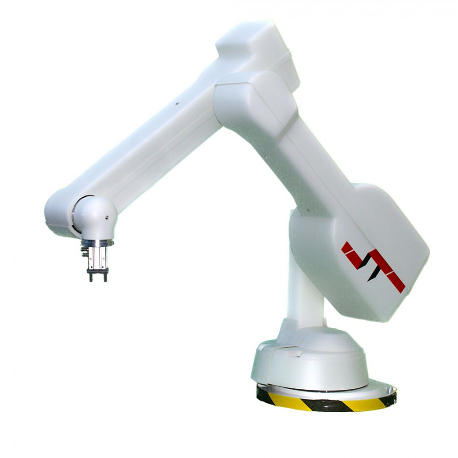

# ST R17 ROS Driver

---

## Introduction

This project is a collection of a C++ ROS driver and , for the ST-R17 5DoF Robot Arm from [ST Robotics](https://www.strobotics.com/).

The hardware for development are based on the Olin College Robo-Lab with Professor Dave Barrett, with the modification of a 3D printed head-attachment as the end effector that also houses a custom-designed servo-actuated gripper (jaw) and a pair of [Microsoft Lifecam Cinemas](https://www.microsoft.com/accessories/en-us/products/webcams/lifecam-cinema/h5d-00013) for stereo vision.

With the above due credits, the works presented here are entirely of my own. This project was initially my development under the Edwin project for the Eusocial Robots Lab (now Interactive Robotics Lab, or [IRL](https://github.com/olinrobotics/irl)), but it ultimately branched out as an independent project.

See [stereo_filter](https://github.com/yycho0108/stereo_filter) for another related development.

## Content

The project includes the following packages, each of which implement a crucial feature in the development of any robotic arm platform:

- **st_r17_ros_driver** : `ros_control` compatible C++ ROS Driver for the ST-R17 Robot Arm through Serial protocol.
- **st_r17_moveit_config** : `MoveIt!` Interface for dynamic trajectory generation and target-pose following.
- **st_r17_description** : URDF (Universal Robot Description Format) of the ST-R17 Robot Arm for description of internal transformations, collisions, and dynamic parameters.
- **st_r17_gazebo** : Gazebo simulation of the ST-R17 Robot Arm for SITL(Software-In-The-Loop) Development.
- **st_r17_calibration** : Closed-loop DH Parameter Calibration via visual landmarks
- **st_r17_ikfast_plugin** : Inverse Kinematics Plugin for efficient analytical solutions for joint-angle computation.

Refer to the README in the respective folders for a more detailed documentation; below, I provide a cursory glance at what each of the above projects implement.

## DH Calibration