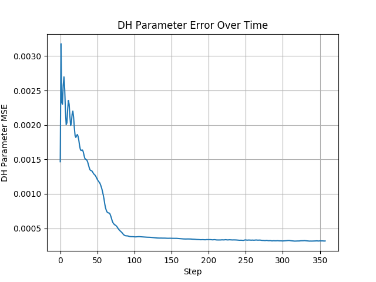
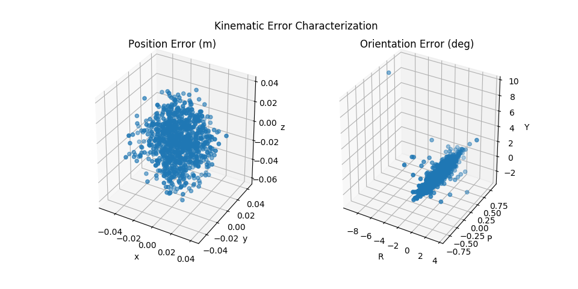

# ST R17 Calibration

DH Parameter Calibration with April Tags.

Currently, the seeds are configured for the ST R17 Arm, but the implementation is universal for all robot arms.

## Results

### Gazebo simulation

[Youtube Link](https://youtu.be/T6hWMyOZmXE)


#### DH Parameters

Unfortunately, calibrated joint angle biases were not recorded.

Nominal:

&alpha;  | a        |d         | &Delta;q |
:-------:|:--------:|:--------:|:--------:|
&pi;     | 0        | -0.355   | 0        |
&pi;/2   | 0        | 0        | -&pi;/2  |
0        | 0.375    | 0        | 0        |
0        | 0.375    | 0.024    | &pi;/2   |
&pi;/2   | 0        | 0.042    | 1.176    |
0        | -0.012   | 0.159    | &pi;     |

Calibrated:

&alpha;  | a        |d         | &Delta;q |
:-------:|:--------:|:--------:|:--------:|
3.1407   |4.62e-4   | -0.373   | N/A      |
1.5714   |-7.18e-3  | 0.029    | N/A      |
-1.04e-3 | 0.385    | -0.028   | N/A      |
-1.94e-3 | 0.380    | 0.027    | N/A      |
1.5703   | 2.12e-3  | 0.060    | N/A      |
1.40e-3  | -6.15e-3 | 0.1274   | N/A      |

#### Kinematic Error


Mean Absolute Error over 1000 Samples:

x (m)  | y (m) | z(m)  |R (deg)|P (deg)|Y (deg)|
:-----:|:-----:|:-----:|:-----:|:-----:|:-----:|
8.32e-3|8.44e-3|1.87e-2|1.03e-1|7.65e-2|4.72e-1|

## Run DH Calibration (Virtual)

[Youtube Link](https://www.youtube.com/watch?v=DozXbHvRHp8)

1. Run the perception stack for detecting target markers.

    The below node publishes a virtual target at a fixed offset from `base_link`:
    
    ```bash
    roscore
    roslaunch st_r17_calibration urdf.launch use_kinect:=false
    rosrun st_r17_calibration target_publisher.py _num_markers:=4 _zero:=false _rate:=100
    rviz -d $(rospack find st_r17_description)/rviz/dh.rviz
    ```

2. Run the Calibrator.
    ```bash
    rosrun st_r17_calibration dh_calibrator.py _num_markers:=4 _noise:=False
    ```

## Run DH Calibration (Gazebo + Vision):

1. Setup the World:

    ```bash
    roscore
    roslaunch st_r17_gazebo gazebo.launch
    roslaunch st_r17_gazebo spawn_tags.launch tag_size:=0.5
    rosrun st_r17_calibration gazebo_target_initializer _num_markers:=4 tag_size:=0.5 _min_Y:=-1.0 _max_Y:=1.0
    ```

2. Setup the Controls:

    ```bash
    roslaunch st_r17_description control.launch
    roslaunch st_r17_moveit_config move_group.launch allow_trajectory_execution:=true fake_execution:=false info:=true debug:=false
    roslaunch st_r17_moveit_config moveit_rviz.launch
    ```

3. Start perception stack and calibration:

    ```bash
    ROS_NAMESPACE=/left rosrun image_proc image_proc
    roslaunch st_r17_calibration apriltags.launch
    roslaunch st_r17_calibration calibrate.launch num_markers:=4 slop:=0.01
    roslaunch st_r17_calibration scouter.launch
    ```

4. Evaluate Performance:

    ```bash
    rosrun st_r17_calibration evaluate_dh.py
    ```
