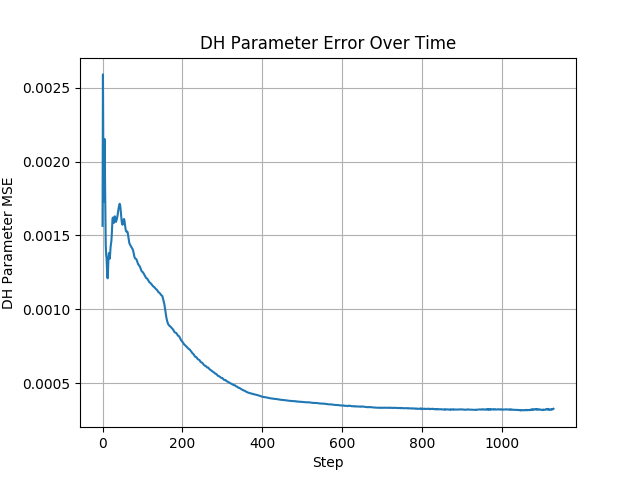

# ST R17 Calibration


DH Parameter Calibration with April Tags.

Currently, the seeds are configured for the ST R17 Arm, but the implementation is universal for all robot arms.

## Results

### Gazebo simulation

[Youtube Link](https://youtu.be/T6hWMyOZmXE)



#### DH Parameters

Nominal:

&alpha;  | a        |d         | &Delta;q |
:-------:|:--------:|:--------:|:--------:|
&pi;     | 0        | -0.355   | 0        |
&pi;/2   | 0        | 0        | -&pi;/2  |
0        | 0.375    | 0        | 0        |
0        | 0.375    | 0.024    | &pi;/2   |
&pi;/2   | 0        | 0.042    | 1.176    |
0        | -0.012   | 0.159    | &pi;     |

Initial:

&alpha;  | a        |d         | &Delta;q |
:-------:|:--------:|:--------:|:--------:|
3.17e+00 |2.06e-02  |-3.86e-01 |7.46e-04  |
1.67e+00 |-6.00e-02 |-5.33e-02 |-1.55e+00 |
-8.37e-04|3.41e-01  |3.31e-03  |-8.81e-02 |
-2.76e-03|3.80e-01  |-6.73e-03 |1.51e+00  |
1.57e+00 |-4.57e-02 |4.83e-02  |1.13e+00  |
-2.32e-02|6.54e-03  |1.61e-01  |3.12e+00  |

Calibrated:

&alpha;  | a        |d         | &Delta;q |
:-------:|:--------:|:--------:|:--------:|
3.14e+00 |3.81e-03  |-3.59e-01 |-1.60e-03 |
1.57e+00 |1.38e-03  |-2.30e-02 |-1.55e+00 |
-1.92e-03|3.66e-01  |2.89e-02  |-1.01e-02 |
-1.67e-03|3.68e-01  |1.23e-02  |1.56e+00  |
1.57e+00 |-8.20e-03 |8.51e-02  |1.14e+00  |
1.47e-03 |7.82e-03  |1.35e-01  |3.18e+00  |

#### Kinematic Error


Mean Absolute Error over 1000 Samples:

x (m)  | y (m) | z(m)  |R (deg)|P (deg)|Y (deg)|
:-----:|:-----:|:-----:|:-----:|:-----:|:-----:|
1.55e-2|1.45e-2|1.69e-2|2.49e-1|1.78e-1|2.37e-1|

## Run DH Calibration (Virtual)


[Youtube Link](https://www.youtube.com/watch?v=DozXbHvRHp8)

1. Run the perception stack for detecting target markers.

    The below node publishes a virtual target at a fixed offset from `base_link`:
    
    ```bash
    roscore
    roslaunch st_r17_description urdf.launch use_kinect:=false
    rosrun st_r17_calibration target_publisher.py _num_markers:=4 _zero:=false _rate:=100
    rviz -d $(rospack find st_r17_description)/rviz/dh.rviz
    ```

2. Run the Calibrator.
    ```bash
    roslaunch st_r17_calibration calibrate.launch num_markers:=4 slop:=0.001
    ```

## Run DH Calibration (Gazebo + Vision):


1. Setup the World:

    ```bash
    roscore
    roslaunch st_r17_gazebo gazebo.launch
    roslaunch st_r17_gazebo spawn_tags.launch tag_size:=0.5
    rosrun st_r17_calibration gazebo_target_initializer _num_markers:=4 tag_size:=0.5 _min_Y:=-1.0 _max_Y:=1.0
    ```

2. Setup the Controls:

    ```bash
    roslaunch st_r17_description control.launch
    roslaunch st_r17_moveit_config move_group.launch allow_trajectory_execution:=true fake_execution:=false info:=true debug:=false
    roslaunch st_r17_moveit_config moveit_rviz.launch
    ```

3. Start perception stack and calibration:

    ```bash
    ROS_NAMESPACE=/left rosrun image_proc image_proc
    roslaunch st_r17_calibration apriltags.launch
    roslaunch st_r17_calibration calibrate.launch num_markers:=4 slop:=0.01
    roslaunch st_r17_calibration scouter.launch
    ```

4. Evaluate Performance:

    ```bash
    rosrun st_r17_calibration evaluate_dh.py
    ```
